# h1 Viisikko

Tässä raportissa on tiivistelmät raportin kirjoittamisesta, sivun luomisesta käyttäen Githubia ja Salt komennoista. Tiivistelmien jälkeen kuvaan Saltin ja Vagrantin kokeilua.

## X - Tiivistelmät (Raportin kirjoittaminen ja FSF)

#### Raportin kirjoittaminen:

- Raportti tehdään sekä ulkopuolisia lukijoita, että itseä varten.
- Raportin on oltava Toistettava. Jos toinen henkilö noudattaa samoja ohjeita, hän päätyy samaan lopputulokseen (ja samoihin virheisiin).
- Raportin on oltava Täsmällinen. Komennot, kellonajat ja työkalut tulee olla tarkasti merkittyinä. Testien tulokset, sekä onnistumiset että epäonnistumiset, on syytä merkitä tarkkaan. Vikailmoitusten tarkka
kopioiminen on välttämätöntä. 
- Raportin on oltava Helppolukuinen. Huolellinen kieli synnyttää luottamusta lukijassa. Raportissa on hyvä myös muistaa mihin sitä ollaan kirjoittamassa (weppisivulle vs koulun valmiiseen pohjaan).
- Lähdeviitteet tulee olla selkeästi merkitty (plagiointi on AINA tuomittavaa.)

#### Create a Web Page Using Github:

- Tee käyttäjä githubiin
- Paina plussasta ja paina kohtaa "new repository"
- Muista AINA luoda "README"-file, muuten asiat voivat mennä rikki!
- Muista myös tekijänoikeuksista huolehtia, vaikka uskoisit ettei niistä mitään hyötyä juuri sinulle ole!
- Tämän jälkeen luo uusi tiedosto ja muista lisätä tiedostonimeen loppuun ".md". Tämä muuttaa tiedoston MarkDown-tiedostoksi.
- "Commit" on coolimpi "save".
- Verkkosivu on nyt julkaistu!

#### Run Salt Command Locally

- Konetta (tällä kurssilla lähinnä virtuaalikoneita) voi kontrolloida Salt:lla.
- Salt toimii Linuxilla, Windowsilla ja Macilla suurinpiirtein samoin.
- Tärkeimmät toiminnot ovat seuraavat (kaikki nämä on selitetty auki myöhemmin tässä raportissa):
  - pkg
  - file
  - service
  - user
  - cmd
- Saltilla normaalisti kontrolloidaan isoja määriä eri koneita.

## Pyhä Viisikko

### a) Hello Windows Salt World!

2.4.2024:

Koska raportin kirjoittaminen oli suhteellisen tuttua jo kurssilta "Linux-palvelimet", niin ehdin jo luennolla asentaa Saltin. Asentaminen sujui niinkin mielenkiintoisesti että latasin Saltin amd64 exe-paketti, 
ajoin sen ja vastasin kaikkiin installerin kaikkiin kysymyksiin "Next". Salt tuli tätäen aennettua Windows-pohjaiselle koneelleni, sen ollessa käytössäni oleva pöytäkone.

Tässä kohdassa oli myös tarkoitus näyttää että saltin asennus on onnistunut, ja seuraavassa näyttökaappauksessa on esimerkki tästä:

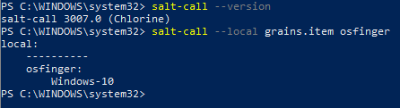

Tässä testissä hyvin yksinkertaisesti Saltin avulla tarkistin saltin version ja oman teitkoneeni Windowsin version. Huomionarvoista on myös se, että Powershell on minulla käytössä järjestelmänvalvojana (administrator).

### b) Hello Vagrant! & c) Linux-virtuaalikone Vagrantilla

Asennus alkoi lataamalla Windowsille sopivan version (`AMD64`) Hashicorp:n sivustolta (https://developer.hashicorp.com/vagrant/install?product_intent=vagrant). Tämän jälkeen aloitin asennusprosessin klikkaamalla juuri lataamaani tiedostoa. Asennusprosessi sujui mukavasti, kun vain paineli kyllä ja next jokaiseen osioon. Tämän jälkeen käynnistin koneen uudestaan, ja Vagrant oli (lähes) käyttövalmis.

Seuraavaksi osaksi tehtävää avasin windowsin powershellin (jälleen kerran administraattorina) ja kirjoitin seuraavassa järjestyksessä ohjeiden mukaiset komennot:

   > vagrant init debian/bookworm64

   > vagrant up

   > vagrant ssh  

Tämän jälkeen pääsinkin suoraan leikkimään Debianiin, kuten seuraavasta näyttökaappauksesta näkyy (toisessa näyttökaappauksessa kuva VirtualBoxiin ilmestyneestä virtuaalikoneesta).

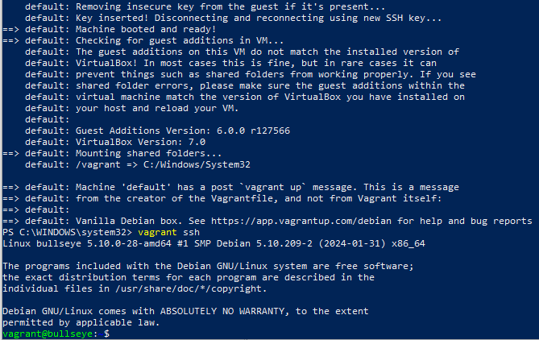

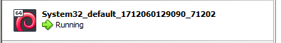

### a) Leikkiminen virtuaalikoneella (eli tehtävänannon  jälkimmäinen a))

Debianilla on hauska leikkiä microsoftin oman powershellin kanssa ("hauska" eli samanlaista). Linuxin perusasiat tulee käydä tosin tälläkin läpi.

   > sudo apt-get update

Samalla asensin salt-minionin ja tarkistin sen version.

   > sudo apt-get -y install salt-minion

   > sudo salt-call --version

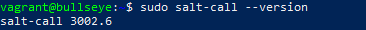

### b) Viisi tärkeintä (pkg, file, service, user, cmd)

#### pkg

Seuraavalla komennolla voi asentaa koneelle tree:n joka listaa tiedostohakemiston "puumaisessa" formaatissa:

   > sudo salt-call --local -l info state.single pkg.installed tree
 
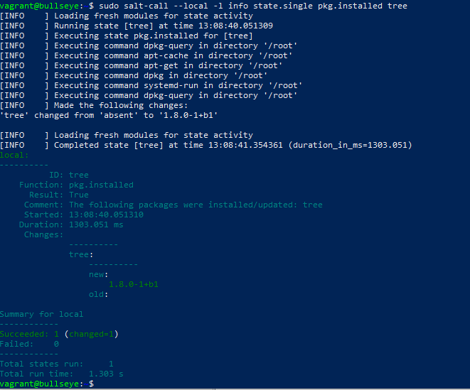

#### file

Seuraavalla komennolla voi luoda tekstitiedoston (esimerkkinä "hellotaco" kansioon /tmp):

   > sudo salt-call --local -l info state.single pkg.installed tree
 
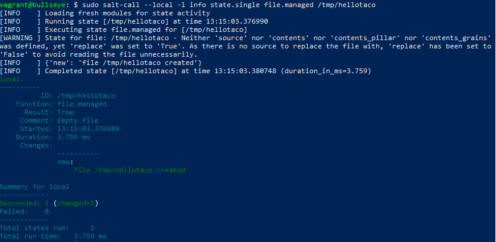

#### service

Seuraavaa komentoa yleensä käytetään automaattisesti käynnistämään demoni, jos sen asetuksia pitäisi muuttaa:

   > sudo salt-call --local -l info state.single service.running apache2 enable=True
 
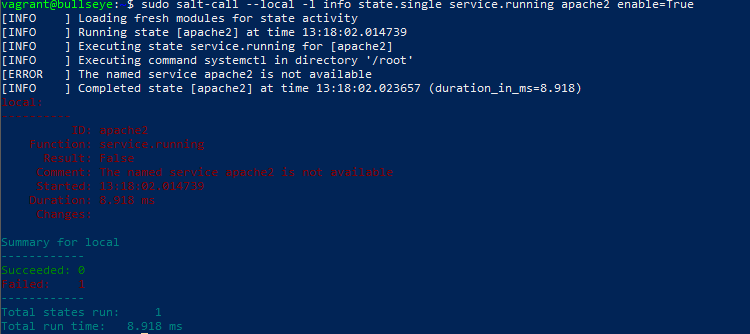

Tämä esimerkki tosiaan heittää erroria, koska apache2 ei ollut asennettuna (käytin pari noloa minuuttia miettien että ei kai tämä pilaa esimerkkiä).

#### user

Seuraavalla komento tarkistaa, onko käyttäjää (tässä tapauksessa käyttäjää "tacova0") olemassa. Jos ei ole, niin komento luo käyttäjän ja jos käyttäjä on olemassa, niin komento antaa käyttäjän tiedot (molemmista esimerkkikuvat alla):

   > sudo salt-call --local -l info state.single user.present tacova0
 
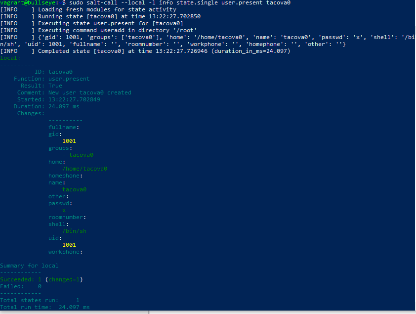

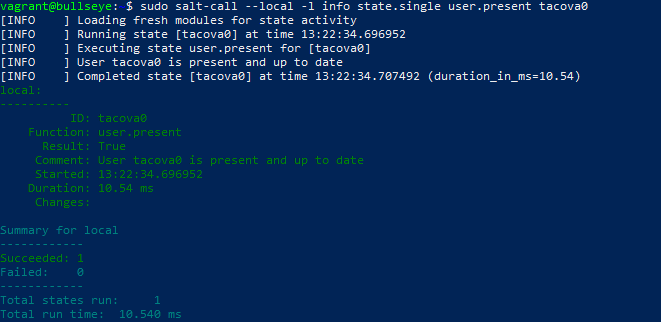

#### cmd

Seuraavalla komento luo tiedoston "foo" kansioon /tmp:

   > sudo salt-call --local -l info state.single cmd.run 'touch /tmp/foo' creates="/tmp/foo"
 
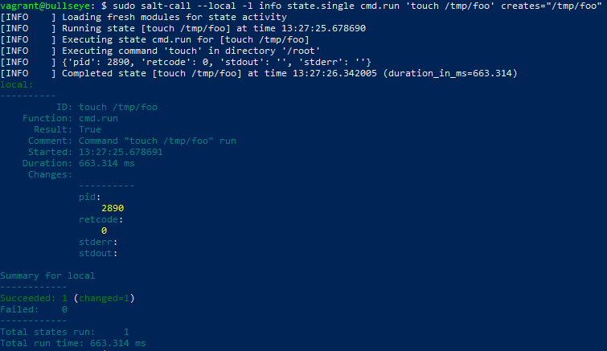

### c) Idempotenttii & d) Tietoa koneesta

Komennolla 'sudo salt-call --local' voi ajaa Salt-minionilla komentoja lokaalisti. Seuraavaksi pari esimerkkiä alle:

   > sudo salt-call --local grains.item osfinger virtual cpu_model

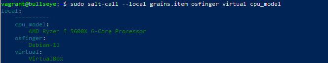

Pakko kyllä sanoa, ettei idempotentti täysin auennut. Wikipedian mukaan sana tarkoittaa sitä, että esim. metodi on idempotentti jos sen vaikutukset on samat riippumatta siitä kuinka monta kertaa se ajetaan. Miten tämä tarkalleen liittyy tähän tehtävään, en äkkiseltään osaa sanoa, mutta pitäähän sitä jotain jäädä luennolle kysyttäväksi :)

Mukava taas päästä tekemään, tästä tulee hyvä kurssi!

## Lähdeviitteet

Karvinen, Tero, saatavilla 2.4.2024: https://terokarvinen.com/2021/salt-run-command-locally/

Karvinen, Tero, saatavilla 2.4.2024: https://terokarvinen.com/2006/06/04/raportin-kirjoittaminen-4/

Karvinen, Tero, saatavilla 2.4.2024: https://terokarvinen.com/2023/create-a-web-page-using-github/

Wikimedia foundation, saatavilla 2.4.2024: https://fi.wikipedia.org/wiki/Idempotenssi

