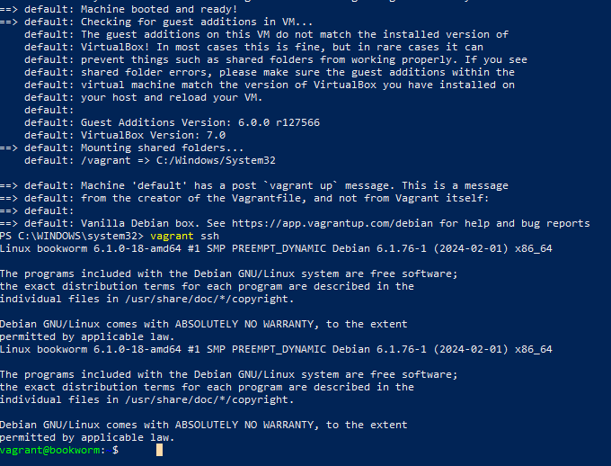

# h1 Viisikko

Tässä raportissa on tiivistelmät raportin kirjoittamisesta, sivun luomisesta käyttäen Githubia ja Salt komennoista. Tiivistelmien jälkeen kuvaan Saltin ja Vagrantin kokeilua.

## X - Tiivistelmät (Raportin kirjoittaminen ja FSF)

Raportin kirjoittaminen:

- Raportti tehdään sekä ulkopuolisia lukijoita, että itseä varten.
- Raportin on oltava Toistettava. Jos toinen henkilö noudattaa samoja ohjeita, hän päätyy samaan lopputulokseen (ja samoihin virheisiin).
- Raportin on oltava Täsmällinen. Komennot, kellonajat ja työkalut tulee olla tarkasti merkittyinä. Testien tulokset, sekä onnistumiset että epäonnistumiset, on syytä merkitä tarkkaan. Vikailmoitusten tarkka
kopioiminen on välttämätöntä. 
- Raportin on oltava Helppolukuinen. Huolellinen kieli synnyttää luottamusta lukijassa. Raportissa on hyvä myös muistaa mihin sitä ollaan kirjoittamassa (weppisivulle vs koulun valmiiseen pohjaan).
- Lähdeviitteet tulee olla selkeästi merkitty (plagiointi on AINA tuomittavaa.)

Create a Web Page Using Github:

- 

Run Salt Command Locally

- Tällä
  -

## Pyhä Viisikko

### a) Hello Windows Salt World!

2.4.2024 - 11.20:

Koska raportin kirjoittaminen oli suhteellisen tuttua jo kurssilta "Linux-palvelimet", niin ehdin jo luennolla asentaa Saltin. Asentaminen sujui niinkin mielenkiintoisesti että latasin Saltin amd64 exe-paketti, 
ajoin sen ja vastasin kaikkiin installerin kaikkiin kysymyksiin "Next". Salt tuli tätäen aennettua Windows-pohjaiselle koneelleni, sen ollessa käytössäni oleva pöytäkone.

Tässä kohdassa oli myös tarkoitus näyttää että saltin asennus on onnistunut, ja seuraavassa näyttökaappauksessa on esimerkki tästä:

Tässä testissä hyvin yksinkertaisesti Saltin avulla tarkistin saltin version ja oman teitkoneeni Windowsin version. Huomionarvoista on myös se, että Powershell on minulla käytössä järjestelmänvalvojana (administrator).

### b) Hello Vagrant! & c) Linux-virtuaalikone Vagrantilla

Asennus alkoi lataamalla Windowsille sopivan version (`AMD64`) Hashicorp:n sivustolta (https://developer.hashicorp.com/vagrant/install?product_intent=vagrant). Tämän jälkeen aloitin asennusprosessin klikkaamalla juuri lataamaani tiedostoa. Asennusprosessi sujui mukavasti, kun vain paineli kyllä ja next jokaiseen osioon. Tämän jälkeen käynnistin koneen uudestaan, ja Vagrant oli (lähes) käyttövalmis.

Seuraavaksi osaksi tehtävää avasin windowsin powershellin (jälleen kerran administraattorina) ja kirjoitin seuraavassa järjestyksessä ohjeiden mukaiset komennot:

   > vagrant init debian/bookworm64

   > vagrant up

   > vagrant ssh  

Tämän jälkeen pääsinkin suoraan leikkimään Debianiin, kuten seuraavasta näyttökaappauksesta näkyy (toisessa näyttökaappauksessa kuva VirtualBoxiin ilmestyneestä virtuaalikoneesta).

### Leikkiminen virtuaalikoneella (eli a) b) c) ja d))

## Lähdeviitteet

Karvinen, Tero, saatavilla 
