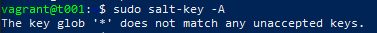
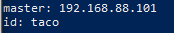

# h2 Soitto kotiin

Tässä raportissa on tiivistelmät kahden laitteen välisestä virtuaalisesta verkosta Debianilla ja Vagrantilla, Saltin quickstartista ja HelloSalt - infraa koodina artikkelista. Tiivistelmien jälkeen kahden 
virtuaalisen koneen välistä verkkoa ja saltin "Herra - Orja" arkkitehtuuria.

## X - Tiivistelmät 

#### Two Machine Virtual Network With Debian 11 Bullseye and Vagrant:

- Artikkelissa nopeat ja suorat ohjeet 2 virtuaalikoneen luomiselle
- Graafinen näkymä ei ole tarvittava
- Toimii käyttöjärjestelmästä riippumatta

#### Salt Quickstart – Salt Stack Master and Slave on Ubuntu Linux:

- Tämä artikkeli kertoo hyvin master-slave arkkitehtuurista
- Master-koneella voi hallita slave-koneita (usein kutsutaan myös minion-koneiksi)
- Hyvät ohjeet Master- ja Minion-koneiden asennukseen
- 

#### Hello Salt Infra-as-Code:

- Artikkeli käösittelee sitä, kuinka luoda "Hello, World!" Salt:lla.
- Artikkelissa luodaan Sklave-koneille yhteinen tiedosto, jonka sisältöä ne voivat ajaa
- Idempotentti on tässäkin tärkeässä osassa

## Soitto Kotiin

### a) 2 virtuaalikonetta samassa verkossa - 15.22, 9.4.2023

Tehtävän ensimmäinen askel oli saada "Vagrantfile" tiedosto Windowsilla auki notepadilla ja vielä adminstratorina, jotta siihen pystyy tekemään muutoksia. Tämä onnistui tällä kertaa avaamalla notepad adminstratorin oikeuksilla ja sen jälkeen notepadin kautta avaamalla tiedosto. Tiedosto oli valmiina jo viime viikon tehtävien jäljiltä.

Kun tiedosto oli ohjeen mukaan muutettu, olivat 2 virtuaalikonetta valmiina. Komennolla `vagrant up` käynnistetään virtuaalikone ajokuntoon. Helppo tapa varmistaa että onnistuiko "Vagrantfile":n muokkaaminen, on seurata mitä powershell tekee kun se pystyttää vagranttia. Jos sekä t001 ja t002 vilahtavat edessäsi, olet tehnyt jotain oikein

Seuraavaksi tehtävänä oli testata löytävätkö koneet toisensa ping-komennolla. Tämä tapahtui helpolla testillä, missä ensin kävin koneella t001 pingaamassa t002-koneen IP:tä ja sama toisinpäin. Tässä kuvat molemmista testeistä.

Testi onnistui hyvin, kuten kuvista huomaa!

### b) Saltin herra-orja arkkitehtuuri toimimaan - 15.44, 9.4.2024

Kesti hetki pähkäillä että miten kaikista järkevimmin tekisin kyseisen tehtävän, kunnes tajusin että edellisen tehtävän virtuaalikoneet t001 ja t002 ovat tähän täydellisiä. Päätin leiikkiä loogista, joten tästä lähtien t001 on "Master"-kone ja t002 on "Minion"-kone. Seuraavilla kahdella komennoilla onnistui sekä "Master" että "Minion" luominen.

    sudo apt-get install salt-master -y

    sudo apt-get install salt-minion -y

Tämän jälkeen edessäni oli Minionin muokkaaminen komennolla

    sudoedit /etc/salt/minion

Lisäsin Masterin IP:n ja id:n tiedostoon, kuten seuraavasta kuvasta näkyy.

IP:n ja id:n lisäämisen jälkeen käynnistin demonin uudelleen seuraavalla komennolla:

    sudo systemctl restart salt-minion.service

Tämän jälkeen ongelmat alkoivat. Komento `sudo salt-key -A` antoi seuraavanlaisen vastauksen:

Mikään kokeilemistani keinoista ei tämän jälkeen onnistunut. Kaikki tiedot näyttivät olevan oikein, IP oli sama kuin mitä se Vagrantfile:n oli määritelty. Mietiun että ehkä id:n lisääminen olisi vaikuttava tekijä, mutta tulos ei muuttunut. Pitkän googlauksen jälkeen en ollut minkäänlaista ratkaisua keksinyt ja päädyin tuijottamaan minion-tekstitiedostoa. Kellon lyötyä 17.45 viimein hoksasin yhden, pienen, mitättömän asian ja kaikki palaset loksahtivat paikoillen ja tein 2 pientä muutosta:

Aikaisemmasta kuvasta tämän ongelman pystyi jo huomaamaan, mutta valitettavasti olin ollut tehtävän tekohetkellä 3 päivää jo kuumeessa, jotenka tällaiset pienet virheet selkeästi koituivat turmiokseni. Koska olin jo yliaikaa päätin lopettaa tehtävän tekemisen lyhyeen Shell-komentoon.

### c) Shell -komento orjalla

Katso edellisen tehtävän viimeinen osa.

### d) Idempotenttien ajaminen - 19:38, 15.4.2023

Tervehtymisen jälkeen päätin tehdä tehtävän loppuun ennen siirtymistä oikeaan aikatauluun. Nyt vuorossa oli idempotenttien testaaminen master-slave -yhteyden yli. 

Päätin aloittaa melko yksinkertaisella esimerkillä ja testata, löytyykö vagrantin käyttäjää orjan koneesta. Tämä tapahtui seuraavalla komennolla:

     sudo salt '*' state.single user.present vagrant

Kuten huomata saattaa, käyttäjä löytyy orjasta. Sama komento ei tuota mitään muutosta, joten se on hyvä esimerkki idempotentista.

Toisena esimerkkinä käytän testitiedoston luomista. Referenssikuvassa on tällä kertaa esimerkissä sama komento 2 kertaa, joissa jälkimmäisessä ainoa muutos on "(changed=1)" kohdan puuttuminen. Tämä testi puolestaan tapahtuu komennolla:

     sudo salt '*' state.single file.managed /tmp/testi

### e) Teknisen tiedon kerääminen

Teknisen tiedon kerääminen on kovin helppoa, mutta oppitunnilta muistin vinkin, että kannattaa silmämääräisesti tarkistaa mitä tietoja haluaa omalta tutulta koneeltaan (usein käyttäjä tietää ainakin oman koneensa komponentit). Testi tapahtui komennolla:

     sudo salt '*' grains.items 

     sudo salt '*' grains.item os oscodename cpu_model 

Ensimmäisestä komennosta tulee esiin pelkkä listaus aikalailla kaikesta, mutta jälkimmäisellä komennolla tulee listan tarkat osat esiin, ja ne näkyvät seuraavassa kuvakaappauksessa.

### f) Hello, IaC

Tässä kohdassa tein samaisen testin, mikä oli hyvin kuvattu tehtävänannon artikkelissa. Loin master-koneella "hello"-moduulin, joka toimii tässä käytännössä "Hello world":inä. Testi alkoi kansion luomisella, seuraavia komentoja käyttäen:

     sudo mkdir -p /srv/salt/hello/
     cd /srv/salt/hello/

Sen jälkeen siirryttiin kirjoittamaan koodi tiedostoon jonka sijaintina tulee olemaan edellämainittu kansio. Tämä tapahtui seuraavalla komennolla (esimerkkikuvassa myös mitä tiedostoon kirjoiteltiin):

     sudoedit init.sls

Moduuli ajettiin komennolla ja siitä tuli seuraavanlainen vastaus:

     sudo salt-call --local state.apply hello

Moduuli toimii kuten pitääkin ja tämä oli myös hyvä esimerkki (jälleen kerran) idempotenssista!

## Lähdeviitteet

Karvinen, Tero, saatavilla 9.4.2024: https://terokarvinen.com/2018/salt-quickstart-salt-stack-master-and-slave-on-ubuntu-linux/?fromSearch=salt%20quickstart%20salt%20stack%20master%20and%20slave%20on%20ubuntu%20linux

Karvinen, Tero, saatavilla 9.4.2024: https://terokarvinen.com/2021/two-machine-virtual-network-with-debian-11-bullseye-and-vagrant/

Karvinen, Tero, saatavilla 9.4.2024: https://terokarvinen.com/2024/hello-salt-infra-as-code/

Karvinen, Tero, saatavilla 9.4.2024: https://terokarvinen.com/2024/configuration-management-2024-spring/
