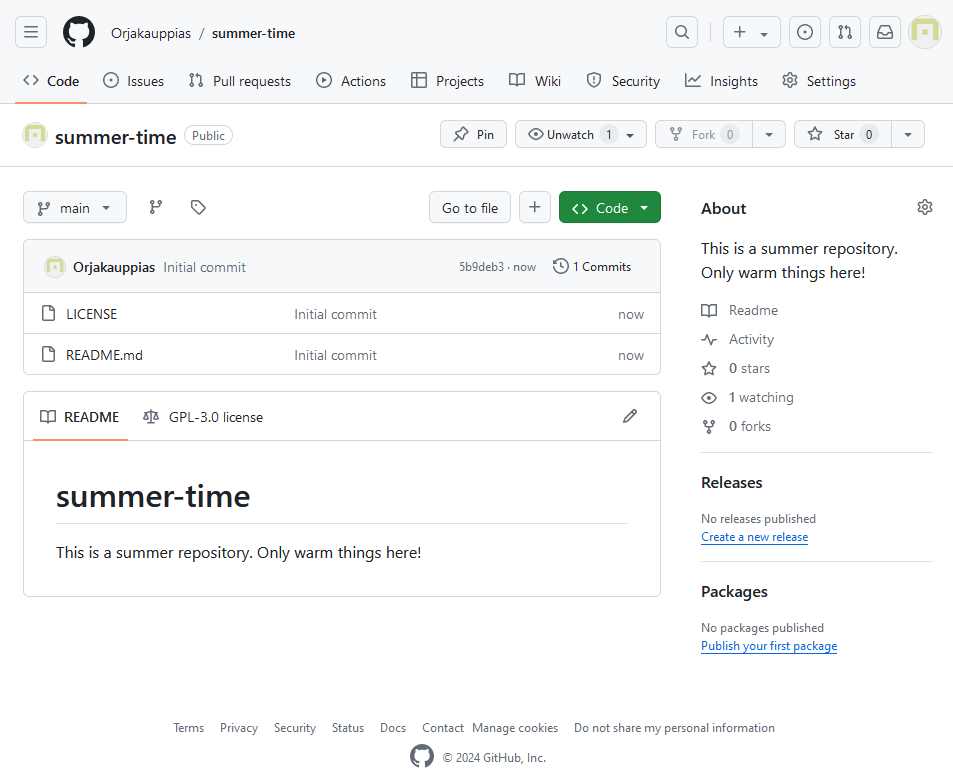
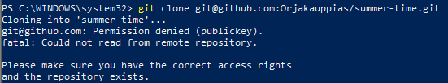
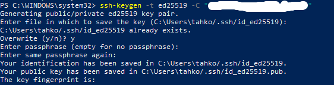
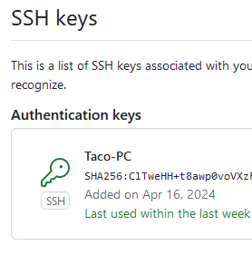
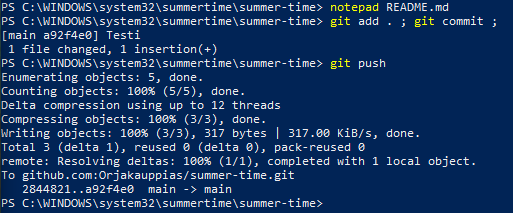
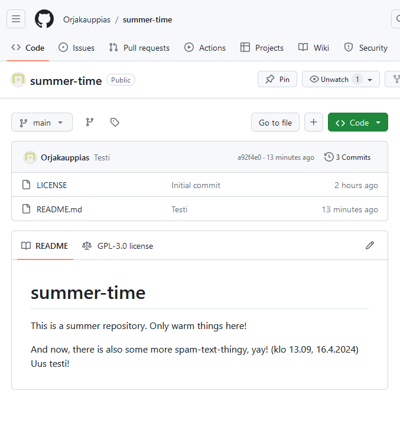
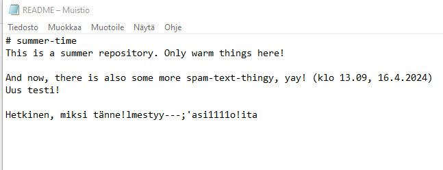
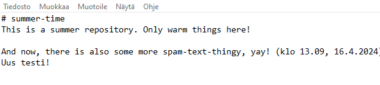
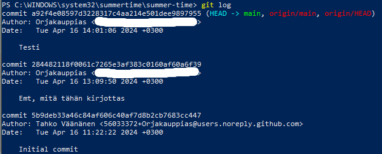

# h2 Toimiva versio

Tässä raportissa on tiivistelmät artikkeleista "Pro git, 2ed: 1.3 Getting started - What is Git?", Gitin käytöstä ja Varaston terokarvinen/suolax/ historiasta, eli lokista ja muutoksista. 

## X - Tiivistelmät 

#### Pro git, 2ed: 1.3 Getting started - What is Git?

- Git on siitä erikoinen että se näkee kaiken tiedon tilannekuvina, eli se näkee kokonaiskuvan kaikista paikoista, vaikka vain yhdessä olisi muutoksia.
- Git saa melkein kaiken tarvitsemansa paikallisista tiedostoista ja resursseista. Se ei tarvitse mitään esimerkiksi paikallisen verkon muilta tietokoneilta.
- Kaikki Gitissä tarkistusnumeroidaan ennen varastointia ja sitten sitä voidaan myöhemmin referoida. Tämä tarkoittaa sitä, että on mahdotonta tehdä mitään muutoksia tai lisäyksiä gitin sisällä ilman mitään merkintää.
- Gittiin laitetaan lähes poikkeuksetta pelkkää dataa. Tämä tarkoittaa sitä, että sieltä on vaikeaa esimerkiksi poistaa mitään, commitin jälkeen.

#### Git add . && git commit; Git pull && git push.

- "Git add" -komento siirtää tulevat muutoksen ns. välitilaan (staging ground). Tämä antaa käyttäjälle aikaa tarkistella vielä kerran, mutta myös valmistelee Gittiä tulevaan muutokseen
- "Git commit" -komento ottaa tilannekuvan (snapshot) välitilasta ja vie sen projektin historiaan.
- "Git pull" -komennolla ladataan vimmeisimmästä kansiosta versio, joka sitten välittömästi yhdistetään nukuiseen projektiin.
- "Git push" -komento on vähän edellisen vastakohta. Se Antaa sinun siirtää paikallisesti tallennetun tiedoston eteenpäin.
  

#### Varaston terokarvinen/suolax/ historia

- Kansiossa on yhteensä 8 committia:
  - Alkuperäinen commit
  - README.md:n päivitys
  - Hello world -moduulin lisääminen
  - Makefile:n lisääminen
  - Favourites-tilan lisääminen, kesken
  - Lisää suosikkiohjelmia edelliseen, lisätty myös lista
  - README.md:n siistiminen
  - Köäyttöohjeiden parantaminen

## Toimiva versio

### a) Online - 11.22, 16.4.2023

Tehtävän ensimmäinen askel oli luoda githubiin varasto (repository, repo). Ainoin avaatimuksina oli ehto, että sekä otsikossa ja varaston kuvauksessa tulee lukea "summer". Tämän lisäksi luomassani varastossa on README.md -tiedosto ja GNU v3 -lisenssi.

### b) Dolly - 11.42, 9.4.2024

Lähdin suorittamaan tätä tehtävää Windowsin PowerShellillä, sillä se on pääasiallisesti käyttämäni koneen järjestelmä. Heti alkuun yrittäessäni kloonata varastoa koneelleni, juoksin ongelmaan, joka johtui SSH-avaimen puutteesta. Komento tosiaan oli seuraavanlainen:

    git clone git@github.com:Orjakauppias/summer-time.git

Kulutin tähän kohtaan huomattavasti enemmän aikaa kuin olisi pitänyt, sillä en tosiaan aikaisemmin ollut SSH-avainta luonut (jostain syystä). Joka tapauksessa, GitHub Docs:ssa on oikein mukavat ohjeet avaimen luomiselle ja kunhan kyseisen artikkelin löysin, niin homma onnistui kovin nopeasti. Prosessi tosiaan eteni seuraavanlaisesti:

Ensin luotiin SSH-avain isäntäkoneella, komennolla:
  
    ssh-keygen -t ed25519 -C "omasähköpostitähän@posti.org"

  
Tämän jälkeen tämä juuri luotu julkinen avain kopioidaan sen oikeasta sijainnista ja liitetään githubiin omaan avainnippuun.

Tämä ratkaisi ongelman ja pääsin kuin pääsinkin kopioimaan varaston itselleni (syötyöni lounaan). Muutosten luominen alkoi README.tiedoston muokkaamisella. Tämän jälkeen seuraavavilla komennoilla heittelin muokkausta githubiin:

    git add . ; git commit ; git push

Huvikseni leikin hieman näillä komennoilla, mutta tässä esimerkkikuva yhdestä testistä:

Loppuun vielä kuva muokastusta varastosta:

### c) Doh! - 13.49, 16.4.2024

Tässä tehtävässä oli tarkoitus tehdä tyhmä muutos gittiin ja tuhota tämä tyhmä muutos. Tärkeä huomio myös oli että committia ei saa tehdä. Päätin muokata edellisen tehtävän tavoin README.md -tiedostoa. Tiedostoon äkkiseltään ilmestyi jotain ihme tekstiä:

Kuitenkin seuraavalla komennolla asiat korjaantuvat:

    git reset --hard

Ja tiedostoon tallentunut tyhmä muutos on poissa:

### d) Tukki - 14.30, 16.4.2024

Tässä tehtävässä tarkasteltiin lokia eli tukkia (log, hehe). Tämä tapahtuu komennolla:

    git log

Lokissa näkyy seuraavat asiat: Commit:n id, tekijä, aikaleima ja mikä muutos on ollut. NÄitä kohtia olisi ollut mahdollista muokata, kuten sähköpostia tai nimeä, mutta päätin sen jättää tekemättä.

### e) Suolattu rakki - 15.58, 16.4.2024

Koska aikaisempaan tehtävään kului enemmän aikaa mitä suunnittelin, jouduin tämän tehtävän jättämään kesken (töihin meneminen on ikävää). Tehtävä ei itselleni täysin auennut Windowsilla, mutta onpahan jotain mitä kysyä tunnilla! Ehkäpä myöhemmin tänään testaan onneani Linuxilla.

## Lähdeviitteet

Atlassian, saatavilla 16.4.2024: https://www.atlassian.com/git/glossary#terminology

Chacon and Straub 2014: Pro Git, 2ed: 1.3 Getting Started - What is Git?, saatavilla 16.4.2024: https://git-scm.com/book/en/v2/Getting-Started-What-is-Git%3F

Github Docs, saatavilla 16.4.2024: https://docs.github.com/en/authentication/connecting-to-github-with-ssh/adding-a-new-ssh-key-to-your-github-account?tool=webui&platform=windows

Karvinen, Tero, saatavilla 16.4.2024: https://github.com/terokarvinen/suolax/
