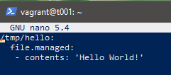
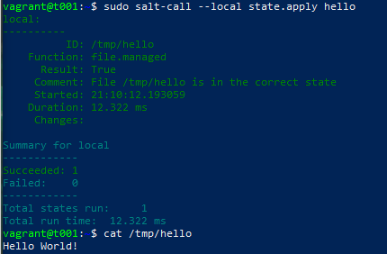
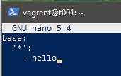
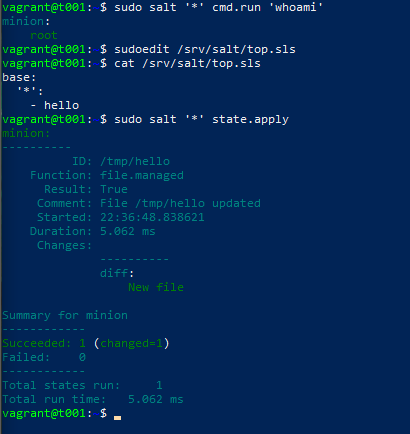
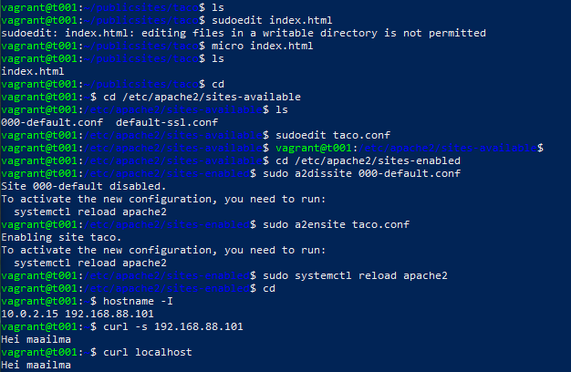
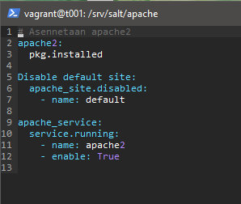
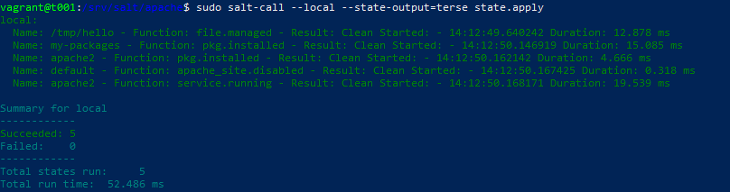
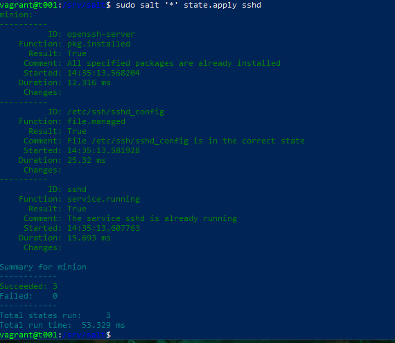

# h4 Demoni

Tässä raportissa on tiivistelmät artikkeleista "Salt Vagrant - automatically provision one master and two slaves", "#Salt contributors: Salt overview" ja "Pkg-File-Service – Control Daemons with Salt – Change SSH Server Port". 

## X - Tiivistelmät 

#### Karvinen 2023: Salt Vagrant - automatically provision one master and two slaves

- `sudo mkdir -p /srv/salt/hello`: Komento luo hakemiston `hello` tielle `/srv/salt`, ja `-p` luo ylemmät hakemistot, jos ne eivät ole vielä olemassa.
- `sudoedit /srv/salt/hello/init.sls`: Komento luo `init`-tiedoston, jonne käskyt kirjoitetaan.
- `top.sls` tiedostoa voidaan käyttää määrittämään minionit pyörittämään tiettyjä tiloja.
  

#### Salt contributors: Salt overview

- YAML on markup kieli, jonka työ on ottaa YAML datastruktuuri ja muuttaa se Python datastruktuuriksi Saltille.
- YAML:n syntaksi on tarkka, ja sen perussääntöihin kuuluu esim:
  - Datastruktuuri on muodossa `key: value`
  - Kaikki ovat case-sensitiivisiä.
  - Tabsit eivät ole sallittuja, saa käyttää vain välilyöntejä.
  

#### Karvinen 2018: Pkg-File-Service – Control Daemons with Salt – Change SSH Server Port

- Pkg-file-Service on hyvä tapa hallita demoneita.
  - Asenna ohjelmisto, korvaa asetustiedosto ja lopuksi käynnistä demoni uudelleen käyttääksesi uutta asetusta.
- Artikkelissa esitellään yksinkertainen tapa vaihtaa Salt:lla SSH-serverin porttia.
  

## Toimiva versio

### a) Hello SLS! - 23.41, 22.4.2023

Tässä tehtävässä luotiin Hei maailma! -tila, tekstitiedostoon kirjoittamalla. Seurasin pääasiallisesti 
tiivistelmämateriaalin ohjeita. Koska usein käytän `vagrant destroy` komentoa aina tehtävien teon pääteeksi,
piti tälläkin kertaa ajaa komennot `sudo apt-get update` ja `sudo apt-get install -y salt-master` jotta 
ainakin osa tarvittavista paketeista olisi valmiina. Tuntuu että aina unohtuu joku paketti, mutta tällä kertaa 
asian pohtiminen kesti vain 10 minuuttia.

Komennolla `sudo mkdir -p /srv/salt/hello`  loin kansioon `srv/salt/` uuden "hello"- Kansion, jonne sisään 
komennolla `sudoedit /srv/salt/hello/init.sls` loin "init"-tiedoston, jonka sisältö näkyy seuraavassa 
kuvankaappauksessa:

Testasin ajaa tilaa seuraavalla komennolla:

    sudo salt-call --local state.apply hello

Ja tämä loi uuden tiedoston (testasin tätä 2 kertaa, jotenka kuvankaappauksessa ei näy "changed=1" merkintää).

Tehtävien tekeminen jatkuu huomenna!

### b) Top - 11.20, 23.4.2024

Jälkikäteen ajateltuna, kannattaa committaa tehtävät aina kun poistut koneelta. Olkoon tämä muistutus itselleni,
vaikka tiedot tässä tapauksessa onneksi säilyivät!

Lähdin tätä tehtävää suorittamaan samaa master-slave arkkitehtuuria käyttämällä, niin kuin aikaisemmissakin 
tehtävissä. Loin "Top file":n, joka määrittelee mitä tiloja millekin minioneille ajetaan. 
Komento `sudoedit /srv/salt/top.sls` loi top.sls -tiedoston. Tiedoston sisältö näyttää tämänlaiselta:

    
    
Tämän jälkeen ajoin komennolla `sudo salt '*' state.apply`  edellisen tiedoston kaikille minioneilleni 
(tässä tapauksessa niitä tosin on vain 1, mutta periaate on tietääkseni sama). Tässä kuvakaappaus prosessista:

### c) Apache easy mode - 13.28, 23.4.2024

#### Manualisaatio

Tehtävässä oli tarkoitus asentaa ensin `sudo apt-get install -y ap apache` käsin, sitten automaattisesti, korvata sen testisivu ja lopulta 
varmistaa demonin käynnistys.

Ensin asensin apachen käsin, tein sille kansion uudelle sivulle ja loin "index.html"-tiedoston kansioon. Tässä lyhyt tiivistelmä 
komennoista, joita apachen kanssa käytin, kuvakaappauksen kera:

    sudo apt-get install -y apache2 
    mkdir -p /publicsite/taco.com
    cd publicsites/taco
    micro index.html
    cd /etc/apache2/sites-available
    sudoedit taco.conf
    cd /etc/apache2/sites-enabled
    sudo a2dissite 000-default.conf
    sudo a2ensite taco.conf
    sudo systemctl reload apache2
    hostname -I
    curl -s 192.168.88.101
    curl localhost
    

#### Automatisaatio

Tässä kohtaa tehtävää oli tarkoitus automatisoida apachen asennus. Tehtävä alkoi yksinkertaisella työvaiheella, jossa
poistin apachen komennolla `sudo-apt-get remove apache2`. Tämän jälkeen loin kansion `/srv/salt/apache` ja sinne 
tiedoston `init.sls`. `init.sls` -tiedoston sisältö tuli olemaan tämän näköinen:

En ollut täysin varma miten korvata testisivu (ja minulla on sellainen kutina että tuo `apache_site.disabled` ei ole
oikea tapa tehdä sitä), mutta se ei rikkonut mitään, joten se saa jäädä tällä haavaa. Mitään erroria ei kuitenkaan 
tullut, joten koen että pääpiirteittäin testi kuitenkin onnistui, kuten tästä kuvankaappauksesta voi päätellä!

### d) SSHouto - 17.15, 23.4.2024

Teshtävässä oli tarkoitus lisätä uusi portti, jossa SSHd kuuntelisi. Tehtäövä alkoi kopioimalla tiedosto `sshd.sls`
kansioon `/etc/ssh/sshd_config` ja muokkaamalla sitä ohjeiden mukaisesti. Tämän lisäksi loin myös tiedoston nimeltä
`sshd.sls`, jonka sisältö on seuraavanlainen:

    openssh-server:
     pkg.installed
    /etc/ssh/sshd_config:
     file.managed:
       - source: salt://sshd_config
    sshd:
     service.running:
       - watch:
         - file: /etc/ssh/sshd_config

Tässä vielä kuvankaappaus edellisen ajamisesta:

Tässä kohtaa aika loppui kesken ja olen melko varma että jos tätä kovempaa olisin lähtenyt testaamaan, olisi eteeni tullut
virhekoodi vähintäänkin minionin suunnalta. Mutta testaaminen jääköön hieman myöhempään!

## Lähdeviitteet

Karvinen, Tero, saatavilla 23.4.2024: https://terokarvinen.com/2023/salt-vagrant/#infra-as-code---your-wishes-as-a-text-file

Karvinen, Tero, saatavilla 23.4.2024: https://terokarvinen.com/2018/04/03/pkg-file-service-control-daemons-with-salt-change-ssh-server-port/?fromSearch=karvinen%20salt%20ssh

VMware, Inc., saatavilla 23.4.2024: https://docs.saltproject.io/salt/user-guide/en/latest/topics/states.html
