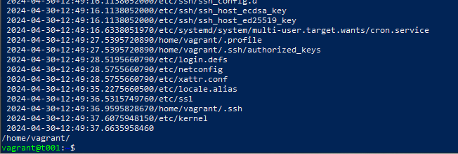

# h5 Tekniikoita

Tässä raportissa on tiivistelmä aikaisemman samaisen kurssin samaisesta tehtävästä (Salt:n käytöstä Windowsilla). Raportissa myös muut tehtävät.

## X - Tiivistelmä 

#### TBA

Tiivistelmä ilmestyy myöhemmin, aikaisempaa kurssityötä ei näyttänyt nopealla googletuksella olevan erityisen vaikeaa löytää.
  
  

## Tekniikoita

### a) Asenna Salt Windowsille - 8.03, 30.4.2023

Tehtävässä oli tarkoitus asentaa Salt Windowsille tai Mac:lle. Käyttämäni koneen käyttöjärjestelmä on Win 10, joten asensin saltin Windowsille. Tehtävässä ei juuri aikaa mennyt, sillä olin saltin jo ehtinyt aikaisemmin. Tässä kuvakaappaus asennuksen testaamisesta komennolla `salt-call --local`:

### b) Kerää koneesta (Windows) tietoa grains.items toiminnolla - 14.08, 30.4.2024

Tässä tehtävässä oli tarkoitus kerätä koneesta tietoa Saltin avulla. Kerääminen onnistui melko rivakasti komennolla `salt-call --local grains.items`, mutta kuten aikaisempien viikkojen eräässä tehtävässä tein, katsoin listasta kiinnostavimmat osat, ja hain ne erikseen. Näitä kiinnostavia tietoja olivat: `cpu-model`, `osfinger` ja `saltpath`. Tuo viimeinen oli erityisen kiinnostava info, sillä olinkin aikaisemmin melko tuskaisesti etsinyt mihin Salt oli tisensä työntänyt. Tässä vielä kuvakaappaus testistä: 

### c) Kokeile Saltin file -toimintoa Windowsilla - 14.48, 30.4.2024

Tehtävässä kokeiltiin Saltin file-toimintoa windowsilla. Saltin file-toiminnolla luodaan tiedosto ennalta määriteltyyn polkuun. Tämä onnistui minulla komennolla `salt-call --local -l info state.single file.managed /srv/salt/testi`. Tällä komennolla loin tiedoston "testi" kansioon /srv/salt/. Tässä kuvakaappaus ratkaisusta:

### d) CSI Kerava - 16.02, 30.4.2024

Tehtävässä oli tarkoitus näyttää "find"-komennon avulla viimeisimmäksi muokatut tiedostot /etc/-hakemistosta ja kotihakemistosta. Komennolla `find ~/ /etc -printf "%p\n %T+" |sort"` tämä tehtävä onnistui. Komento piti avata ja selittää: 

 - `find` on se funktio mikä etsii
 - `~/` ja `etc` määrittelevät hakukohteiksi kotihakemiston ja "etc"-hakemiston
 - `-printf` jotta seuraava osa komentoa luettaisiin oikein
 - `%p\n` tuo tiedoston nimen
 - `%T+` puolestaan tuo aikaleiman
 - `|sort` järjestää haun oikein

Tässä vielä kuvakaappaus tehtävästä:

### e) Komennus - xx.xx, 30.4.2024

Tässä kohtaa vappukiireet tulivat eteeni, mutta ajattelin jatkaa vapun jälkeen täydellä tarmolla!

## Lähdeviitteet

