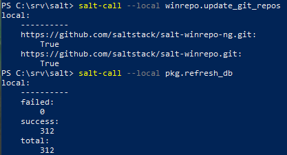
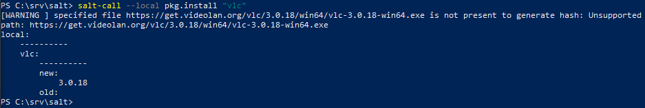

# h6 Benchmark

Tässä raportissa on tiivistelmä Salt:n Windows Package Managerista.

## X - Tiivistelmä 

#### Windows Package Manager

- Introduction
  - Ohjeet Saltin tarjoamaan omaan paketinhallintatyökaluun Windowsille (asennus, pävitys, poistaminen ja softapakettien hallitseminen)
  - Voi soveltaa hyvin etä-ympäristössä
  - Tämä tapahtuu käyttämällä YAML/JINJA2-tiedostoja (`.sls`-päätteisiä), jotka sisältävät ohjelmistopaketin nimen, version, latausssijainnin, komentorivikuytkimet hiljaiselle asennukselle ja poistolle ja käytetäänkö Windowsin tehtävien ajoitusta (Windows Task Scheduler) paketin asentamiseen
  - Näitä tiedostoja voidaan hostata yhdestä tai useammasta git-reposta. Salt ei jaa oletuksena näitä `.sls` tiedostoja joita pakettien asentamiseen Windowsille käytetään, vaan ne kloonataan oletusreposta "salt-winrepo-ng".
  - Saltissa `pkg.install` asentaa paketin (riippuen käyttöjärjestelmästä) ja `pkg.installed` tarkistaa kyseisen asennuksen tilan.

- Install libraries
  - Jos käytät Salt:n Windows package manageria Salt Git-repojen kanssa, kannattaa asentaa joko `GitPython` tai `pygit2`. 

- Populate git repository
  - Komento `salt-run winrepo.update_git_repos` kloonaa hakemiston Salt Master-koneelle `winrepo_dir_ng` -määrittelemään paikkaan.
  - Komento `salt-call --local winrepo.update_git_repos` tekee saman, mutta tämä kloonaa puolestaan saman hakemiston Minion -koneelle jolla ei ole Salt Masteria.

- Update minion database
  - Komento `salt -G 'os:windows' pkg.refresh_db` päivittää Minion -koneelle tietokannan pakettimäärittelytiedostoja varten.
  - Sama prosessi voidaan tehdä Minion -koneelle, jolla ei ole Salt Master -konetta komennolla `salt-call --local pkg.refresh_db`.

- Install software packages
  - Kun edellämainitut kaksi asiaa on tehty, komennolla `salt-call * pkg.install 'tähänpaketinnimi'` voidaan asentaa softapaketteja
  - Masterless minionille komento on `salt-call --local pkg.install "tähänpaketinnimi"`.

- Usage
  - Komento `pkg.list_pkgs` näyttää listan kaikista järjestelmään asennetuista paketeista. Komennosta voi myös katsoa voiko kyseistä softwarea hallita Salt:n avulla vai ei.
  - Komento `pkg.list_available` näyttää kaikki versiot tietystä järjestelmään asennetusta paketista.
  - Komento `pkg.install` asentaa annetun paketin. Tällä komennolla voi myös päättää minkä version asentaa.
  - Komento `pkg.remove` poistaa annetun paketin.
  
  

## Benchmark

### a) Paketti Windowsia - 11.07, 7.5.2023

Tehtävässä oli tarkoitus asentaa Windowsille Salt:n avulla ohjelmia `pkg.installed`-funktiolla. Seurasin Melko yksityiskohtaisesti tiivistelmän artikkelin ohjeita. Käytin komentoja `salt-call --local winrepo.update_git_repos` ja `salt-call --local pkg.refresh_db` laittaakseni Saltin valmuiteen paketin asentamiselle. Tässä kuvakaappaus lyhyestä prosessista: 

Päätin pakettina asentaa VLC-videoplayerin. Tässä asennuksesta kuva (komento `salt-call --local pkg.install "vlc"`):

### b) Benchmark - 12.48, 7.5.2024

Tässä tehtävässä oli tarkoitus etsiä 3-7 muuta keskitetyn hallinnan projektia, esimerkiksi samaisen kurssin "Oma moduli" lopputöitä. Päätin ottaa tarkasteluun seuraavat projektit:

  - Toni Vapalo - Oma moduli - Palvelinten hallinta viikkotehtävä 7
  - Sampo Hautala - Ph h7 / Oma moduli
  - Janne Mustonen - Oma moduuli h7(Palvelinten hallinta)

    
#### 1. Toni Vapalo - Oma moduli - Palvelinten hallinta viikkotehtävä 7

 ##### Tarkoitus:  

 Tätä moduulia käyttäisin jos tarvitsisin itselleni käyttöön Python flask ja React -ohjelmistot.

 ##### Lisenssi:

Linkki githubiin löytyi kivasti heti tehtävän intron alusta (tyhmänä hyppäsin etsimään sitä heti lopusta), githubista löytyi lisenssi, joka oli GNU 3.0. Kyseinen lienssi on vapoaiden ohjelmistojen lisenssi, joka antaa käyttäjälle luvan käyttää, muokata ja jakaa tiedostoa. Lisenssi kuitenkin velvoittaa käyttäjän säilyttämään alkuperäisen tekijän tietoja ja käyttämään samaa lisenssiä muokatuissa versioissa. Lisenssin alaista materiaalia käyttävän pitää sitoutua noudattamaan sen ehtoja.

##### Tekijä ja vuosi

Tekijä Toni Vapalo ja tekovuosi 2021.

##### Riippuvuudet

Raportissa mainitaan Vagrantin käyttöjärjestelmän olleen Linux Debian 10. Muuten alustasta ei ole mainintaa.

##### Kiinnostavia asioita

Mielenkiintoista huomata että samat ratkaisut eivät toimineet (näennäisesti) samankaltaisiin ongelmiin. Se myös nostaa aina itseluottamusta kun muutkin juoksevat ongelmiin.

#### 2. Sampo hautala - Ph h7 / Oma moduli

 ##### Tarkoitus:  

Tällä moduulilla voisin asentaa front-end -deville työympärisön Linuxille. Mukavaa että meitä harvoja Windows -käyttäjiä on muistettu (sarkasmia, pahoitteluni), sillä samaista moduuli voisi käyttää asentamaan kuvanmuokkaus ja 3D-mallinnusohjelmia.

 ##### Lisenssi:

Linkki githubiin löytyi artikkelin lopusta. Githubista löytyi lisenssi, joka oli GNU 3.0. Kyseinen lienssi on vapoaiden ohjelmistojen lisenssi, joka antaa käyttäjälle luvan käyttää, muokata ja jakaa tiedostoa. Lisenssi kuitenkin velvoittaa käyttäjän säilyttämään alkuperäisen tekijän tietoja ja käyttämään samaa lisenssiä muokatuissa versioissa. Lisenssin alaista materiaalia käyttävän pitää sitoutua noudattamaan sen ehtoja.

##### Tekijä ja vuosi

Tekijä Sampo Hautala ja tekovuosi 2018.

##### Riippuvuudet

Linux-koneissa käyttöjärjestelmä oli Ubuntu 18.04.1 LTS ja Windows-koneissa Windows 10 Pro. 

##### Kiinnostavia asioita

On hauska huomata että tekniikat ovat samanlaisia vaikka aikaa onkin jo mennyt 6 vuotta artikkelin kirjoittamisesta. Ottaen huomioon kuinka pitkä prosessi olisi jokaisen ohjelman asentaminen manuaalisesti, tekee paketinhallinta ihmeitä!

#### 3. Janne Mustonen - Oma moduuli h7(Palvelinten hallinta)

 ##### Tarkoitus:  

Käyttäisin moduulia jos minun pitäisi asentaa valmiiksi conffattuja ohjelmistoja Linux-koneelleni. 

 ##### Lisenssi:

Mitään lisenssiin viittaavaankaan ei löytynyt artikkelista (paitsi lähteistä, mutta se ei juuri hyödytä).

##### Tekijä ja vuosi

Tekijä Janne Mustonen ja tekovuosi 2020.

##### Riippuvuudet

Moduuli suunniteltu toiminmaan milä tahansa Linux-distrolla.  

##### Kiinnostavia asioita

Ei uusia huomioita.

### c) Testbench - 16.16, 7.5.2024

Testaaminen jäi pois aikataulupuutteiden johdosta, pitää palata tähän ennen omaa moduulia.

### d) Viisi Ideaa - 16.16, 7.5.2024

Tehtävässä oli tarkoitus lkistata viisi ideaa omalle moduulille, jota käytetään kurssin lopputehtävänä.

Ideoitani:
1. Mahdollisesti asentaa keskitetysti jonkun tietyn ryhmän paketteja. Esim. ohjelmointiin tarvittavia paketteja.
2. Jokin tapa puhdistaa konetta, tuntuu siltä että olen asentanut tiedostoja ympäri koko koentta (tai ehkä järjestely olisi parempi termi).
3. Keskitetyn hallinnan alaisena oleva verkko virtuaalikoneilla?
4. Tapa testata moduulin toiminta eri aluistoilla (mac, windows, linux)
5. Edelliseen liittyen, tapa määrittää ohjelmisto alustariippumattomaksi

(2 viimeistä kuulostaa villeiltä, että kahtellaan mahdollisuuksien mukaan :D)

## Lähdeviitteet

VMware, Inc.; Saatavilla 7.5.2024: https://docs.saltproject.io/en/latest/topics/windows/windows-package-manager.html#masterless-minion-configuration

Vapalo, Toni; Saatavilla 7.5.2024: https://tonivapalo.com/posts/palvelintenhallinta/phvt7/

Hautala, Sampo; Saatavilla 7.5.2024: https://sampohautala.wordpress.com/2018/12/09/ph-h7-oma-moduli/

Mustonen, Janne; Saatavilla 7.5.2024: https://jannelinux.design.blog/2020/05/19/oma-moduuli-h7/

