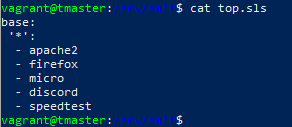
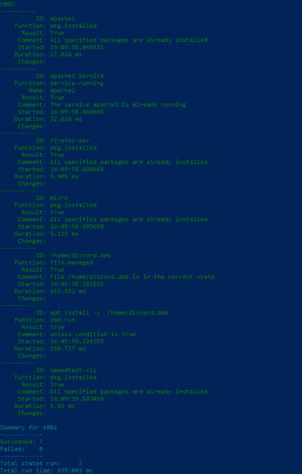

# h7 Oma Moduli

Tässä raportissa kerron kurssin lopputehtävän luomisesta. Alun perin tarkoituksenani oli asentaa Salt:ia käyttäen React ympäristö, mutta tämä osoittautui liian haastavaksi aikataulupuutteiden takia. Lopputyön aiheeksi tuli kiireiden vuoksi hieman suppea ja pieni moduuli, jolla asentaa joitakin satunnaisen hyödyllisiä ohjelmia  Salt:ia käyttäen.  

### Tarkoitus & Lisenssi

Tämän moduulin tarkoituksena on asentaa erilaisia ohjelmia nopeasti ja helposti käyttäen Salt:ia (master-slave -arkkitehtuuria) usealle virtuaalikoneelle samanaikaisesti.

Lisenssinä toimii GNU General Public License 3.0.

Pääasiallisena toimintaympäristönä moduulissa on oman kotikoneen Windows 10 Home 64-bit ja virtuaalikoneilla on  käyttöjärjestelmänä Linux/Debian 5.10.209-2.

### Asennusohje

#### Moduulin pohja

Salt:n asennettiin moduulissa täältä: https://docs.saltproject.io/salt/install-guide/en/latest/topics/downloads.html

Virtuaalikoneet on hostattu käyttäen VirtualBox:ia, asennettu täältä: https://www.virtualbox.org/wiki/Downloads

Virtuaalikoneiden luomiseen on käytetty vagrant työympäristöä, asennusohjeet itse Vagrantille löytyvät täältä: https://developer.hashicorp.com/vagrant/install

Vagrant virtuaalikoneita tässä moduulissa on 3 kappaletta: 1 master-kone, ja 2 minion-konetta. Nämä koneet on luotu käyttäen Tero karvisen ohjeita: https://terokarvinen.com/2023/salt-vagrant/

#### Moduuli

Moduulissa asennetaan Salt:ia käyttäen master-koneelta molemmille minioneille apache2, firefox, speedtest, micro ja discord.

Ensimmäiset 3 ovat melkoisen helppoa asentaa, mutta discord vaati hieman erilaisen lähestymistavan:

Löysin nopealla googletuksella hyviä ohjeita, mutta onnistumaan sain seuraavan linkin takana olleet ohjeet: https://www.linuxcapable.com/how-to-install-discord-on-debian-linux/ 

Komennolla `wget "https://discord.com/api/download?platform=linux&format=deb" -O discord.deb` ladataan asennuspaketti suoraan Discordin nettisivuilta.

Tämän jälkeen komennolla `sudo apt install ./discord.deb` paketti asennettiin Discord master -koneelle.

Master-koneella komennolla `mkdir /srv/salt/` luodussa kansiossa luotiin samaisella `mkdir`-komennolla seuraavat kansiot:

- apache2
- firefox
- speedtest
- micro
- discord

Jokaisessa kansiossa on init.sls -tiedosto, joissa on tarvittavat komennot asennukselle. Tiedostojen sisällöt on listattu tähän alle:

    Kansio "apache2:
  
    # Apache2 install & run
    apache2:
      pkg.installed

    apache2 Service:
      service.running:
        - name: apache2

    Kansio "firefox":
    
    # Firefox install:
    firefox-esr:
      pkg.installed

    Kansio "speedtest":

    # Speedtest install:
    speedtest-cli:
      pkg.installed

    Kansio "micro":
    
    # Micro install
    micro:
      pkg.installed

    Kansio "discord":

    # Discord install
    /home/discord.deb:
      file.managed:
        - source: salt://discord.deb

    apt install -y /home/discord.deb:
      cmd.run:
        - unless: echo /home/discord.deb

Top.sls tiedoston sisältö on tämänlainen:

Kun top.sls on kunnossa, komennolla `sudo salt '*' state.apply asennetaan kaikille minioneille ohjelmat. Tässä kuva lopputuloksesta:

### Loppusanat

Itseäni harmittaa ettei alkuperäinen idea onnistunut. Tällaisen projektin laajuus ainakin itselleni oli liikaa muiden kurssien ohessa ja näin lyhyellä aikataululla, mutta olen tyytyväinen kuitenkin siihen että jotain sain valmiiksi.

## Lähdeviitteet

Karvinen, Tero; Saatavilla 14.5.2024: https://terokarvinen.com/2023/salt-vagrant/

LinuxCapable; Saatavilla 15.5.2024: https://www.linuxcapable.com/how-to-install-discord-on-debian-linux/

Virtualbox; Saatavilla 15.5.2024: https://www.virtualbox.org/wiki/Downloads

VMware, Inc.; Saatavilla 15.5.2024: https://docs.saltproject.io/salt/install-guide/en/latest/topics/downloads.html

HashiCorp; Saatavilla 15.5.2024: https://developer.hashicorp.com/vagrant/install?product_intent=vagrant
